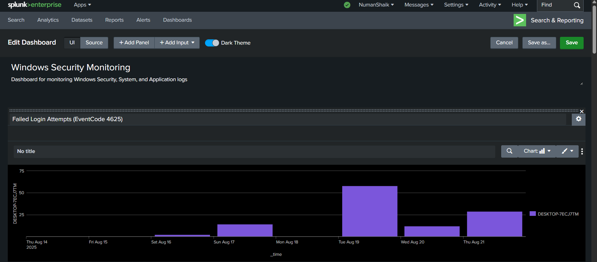
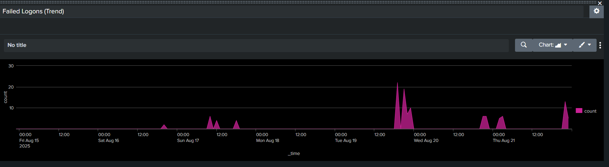
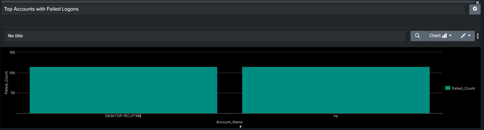
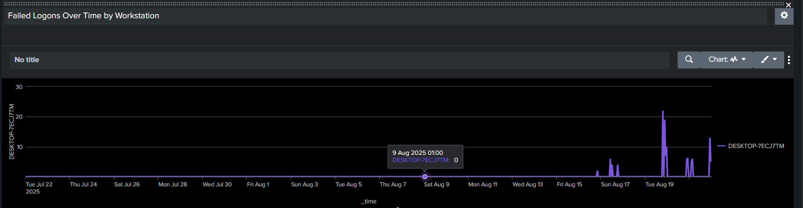
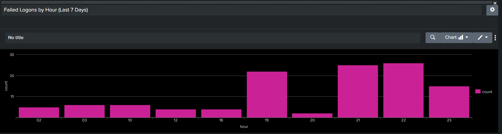
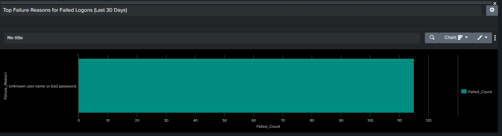
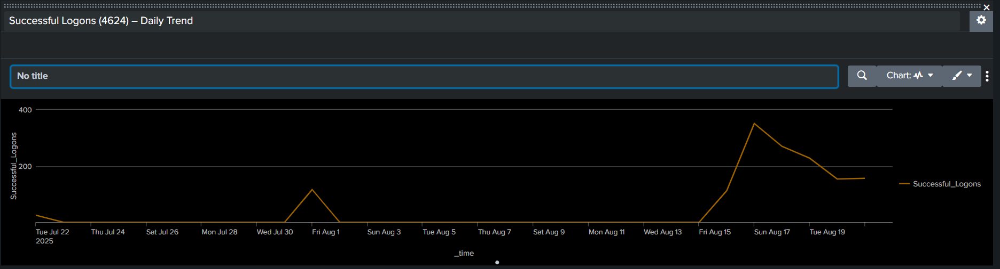
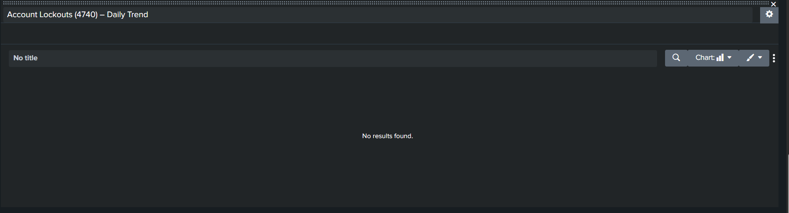

## 📊 Dashboard Screenshots

### Failed Login Attempts (EventCode 4625)


### Failed Logons Trend


### Top Accounts with Failed Logons


### Failed Logons Over Time by Workstation


### Failed Logons by Hour (Last 7 Days)


### Top Failure Reasons (Last 30 Days)


### Successful Logons (4624) – Daily Trend


### Account Lockouts (4740) – Daily Trend

-------------------------------------------------------------------------------------------------
## 🔍 SPL Queries 
### 1) Failed Login Attempts (EventCode 4625) — Daily Count
```spl
index=winlogs sourcetype=WinEventLog:Security EventCode=4625
| timechart span=1d count AS Failed_Logons
